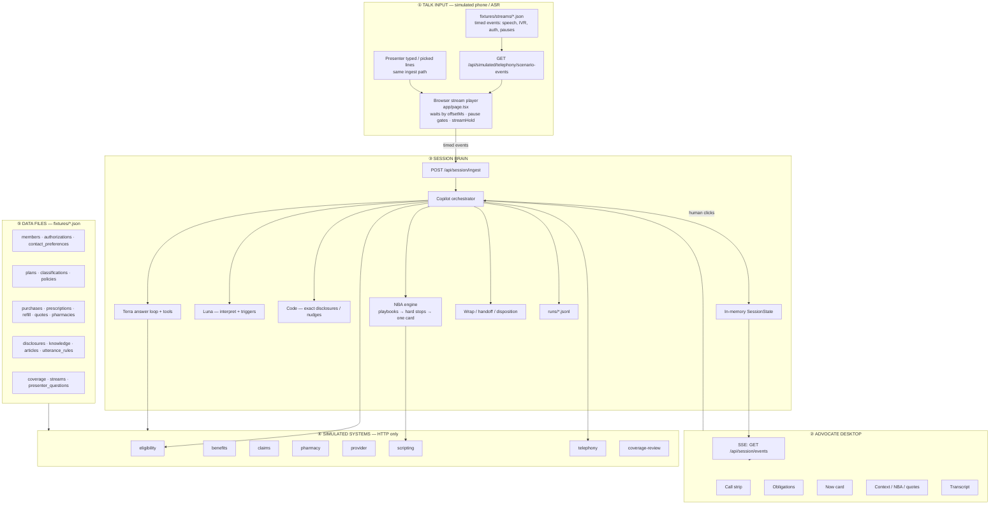
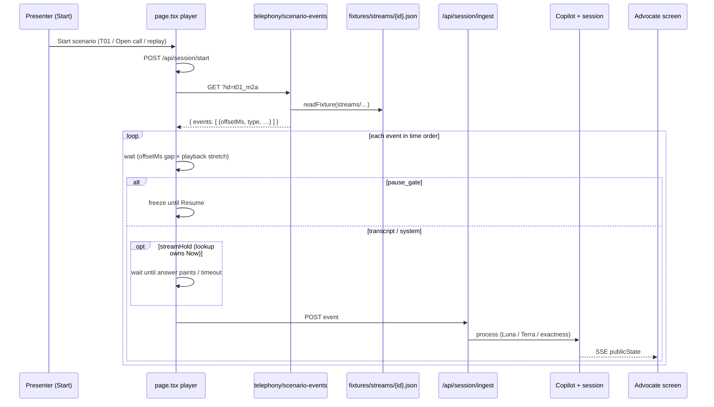
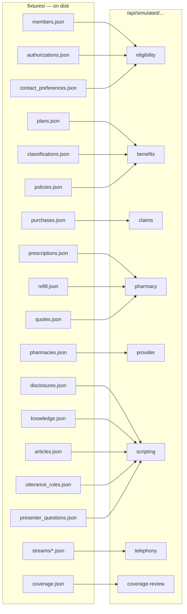
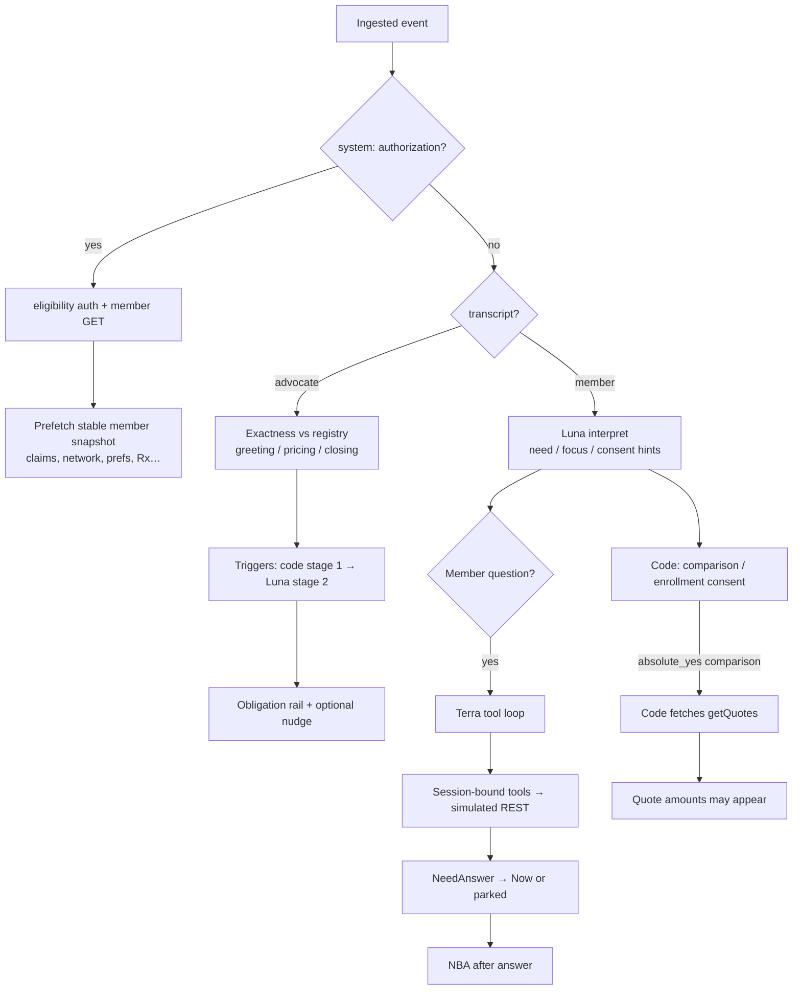
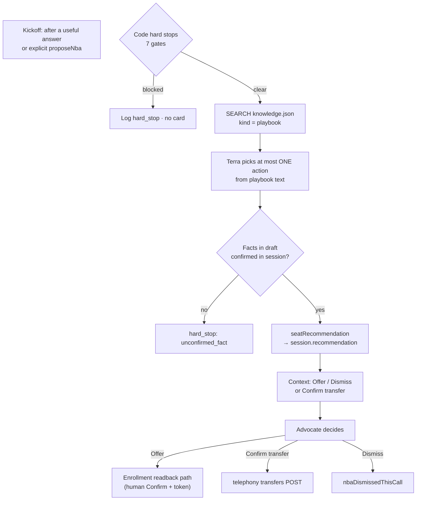
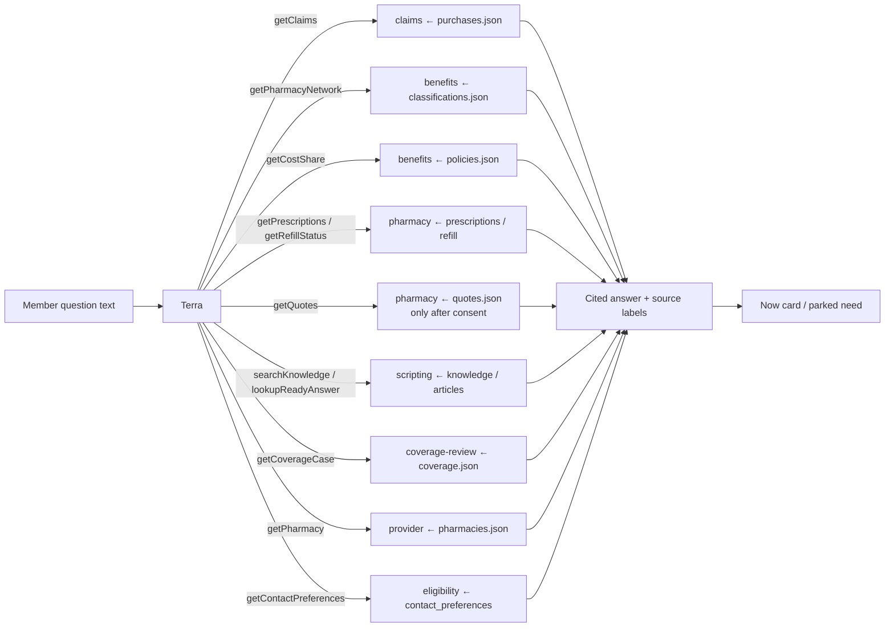

# System architecture — Humana Agent Assist (full picture)

One Next.js app. Four layers work together:

1. **Talk input** — a timed transcript player (and optional presenter typing) simulates the phone call
2. **Session brain** — interprets speech, answers questions, proposes next actions, enforces rules
3. **Simulated Humana systems** — HTTP APIs that only read from fixture JSON files
4. **Advocate screen** — five regions updated live over SSE

Nothing in `app/` or `lib/` imports fixture files for answers. Fixtures are loaded **only** inside `/api/simulated/`* handlers.

---

## 1. Entire system at a glance




---


## 2. How the transcript stream works

This is **not** a live phone. The browser plays a scripted timeline that stands in for telephony + ASR.




### What a stream event carries


| `type`                     | Example                                                                 | What the brain does                      |
| -------------------------- | ----------------------------------------------------------------------- | ---------------------------------------- |
| `transcript`               | Member/advocate words + `stability` (partial/final/corrected/uncertain) | Interpret, triggers, maybe answer loop   |
| `system` + `ivr_hint`      | Call reason from phone menu                                             | Fetch telephony IVR hint → session       |
| `system` + `authorization` | Simulated identity check                                                | POST eligibility auth → load member      |
| `pause_gate`               | “Advocate should react here”                                            | Player pauses; not counted as AI latency |


**Also feeds the same pipe:** presenter “Caller says…” / “You say…” / End call — same `ingest`, not a second brain.

**Files:** `fixtures/streams/open_call.json`, `t01_m2a.json`, `t02a`…`t08b.json`.

---


## 3. Fixture files → fake data subsystems

Each JSON file is a stand-in database. Only simulated route handlers open them.




### Mapping table (what each file mimics)


| Fixture file               | Mimics                                       | Served by        | Typical fields / rows                          |
| -------------------------- | -------------------------------------------- | ---------------- | ---------------------------------------------- |
| `members.json`             | Member master                                | eligibility      | memberId, name, planId, LOB                    |
| `authorizations.json`      | ID&V / auth                                  | eligibility      | authorizationId, decision VALID, scopes        |
| `contact_preferences.json` | Contact / mail flags                         | eligibility      | doNotContact, mailServiceEnrolled              |
| `plans.json`               | Plan catalog                                 | benefits         | planId, plan facts                             |
| `classifications.json`     | Pharmacy network as-of date                  | benefits         | preferred vs standard by date                  |
| `policies.json`            | Cost-share / policy                          | benefits         | plan cost rules                                |
| `purchases.json`           | Pharmacy claims                              | claims           | $8 / $27 fills, dates, pharmacy                |
| `prescriptions.json`       | Active Rx                                    | pharmacy         | drug, strength, quantity                       |
| `refill.json`              | Refill request + status                      | pharmacy         | READY_FOR_PICKUP etc. (**always fetch fresh**) |
| `quotes.json`              | Prospective price quotes                     | pharmacy         | estimatedMemberCost (locked until consent)     |
| `pharmacies.json`          | Pharmacy directory                           | provider         | Lakeview, Oak Street, CenterWell names         |
| `disclosures.json`         | Required legal wording                       | scripting        | verbatimText (byte-for-byte)                   |
| `knowledge.json`           | Policies + **NBA playbooks** + search corpus | scripting SEARCH | policy / article / playbook chunks             |
| `articles.json`            | Service / FAST90 / objection copy            | scripting        | article bodies                                 |
| `utterance_rules.json`     | Consent / quote cue patterns                 | scripting        | loaded at session start                        |
| `coverage.json`            | Coverage-review cases                        | coverage-review  | pending case, no determination write           |
| `streams/*.json`           | Call timeline (ASR stand-in)                 | telephony        | offsetMs events                                |
| `presenter_questions.json` | Demo “Try a question” list                   | scripting        | topic + question text                          |


Every HTTP reply looks like:

```text
{ simulated: true, sourceSystem: "pharmacy", asOf: ISO-time, data: { … } }
```

Overlays for replays (T04B / T06A / …) can change what a handler returns via `X-Demo-Overlay` without changing the player.

---


## 4. Session brain — what happens to each utterance




---


## 5. Next-best-action (NBA) system

NBA is **not** a separate microservice. It is a dedicated path inside the brain after (or alongside) answers.




### Hard stops (code — model cannot override)


| Stop                  | Meaning                                     |
| --------------------- | ------------------------------------------- |
| `unverified`          | No VALID identity yet                       |
| `due_now`             | Required pricing/closing wording owns Now   |
| `already_enrolled`    | Mail service already on                     |
| `said_no`             | Member refused this call                    |
| `do_not_contact`      | Preference flag                             |
| `dismissed_this_call` | Advocate dismissed once                     |
| `unconfirmed_fact`    | Draft cites a fact not confirmed in session |


### What NBA reads

- **Playbooks** from `knowledge.json` (via scripting SEARCH) — action id, pill name, advocate control  
- **Session facts** — claims, network, contact prefs, coverage case, conversation  
- **Never tools:** enroll, decide coverage, take payment, clinical advice

Advocate **Offer / Dismiss / Confirm transfer** are human API routes; AI only drafts the card.

---


## 6. Answer path — data flowing through tools




**Binding rule:** tools use the **session’s** `memberId` / `planId`. The model cannot pass another member’s id.

---


## 7. What the screen shows vs where it came from


| Screen region   | Main data source                                            |
| --------------- | ----------------------------------------------------------- |
| Call strip      | Session identity + IVR (after auth)                         |
| Obligation rail | Disclosure registry + exactness state                       |
| Now card        | Required wording **or** Terra answer **or** system message  |
| Context drawer  | Needs list, quotes, NBA recommendation, evidence            |
| Transcript      | Stream + presenter lines (stability marked)                 |
| Presenter bar   | Scenario picker → stream file; member picker → members.json |


Live updates: **SessionState →** `publicState` **→ SSE → React**.

---


## 8. Persistence / side stores


| Store                                | Role                                  |
| ------------------------------------ | ------------------------------------- |
| In-memory `Map` of sessions          | Live call state                       |
| `runs/<sessionId>.jsonl`             | Audit: tools, NBA, triggers, timings  |
| Ready-answer disk cache (gitignored) | Generated general FAQs from docs      |
| `fixtures/`                          | Only database the simulated APIs have |


---


## 9. One full call — data moving left to right

```text
streams/t01_m2a.json
        │  (offsetMs events)
        ▼
 Browser player ──ingest──► Copilot
                              │
              ┌───────────────┼────────────────┐
              ▼               ▼                ▼
           Luna            Exactness         Terra tools
        (need/consent)   (registry text)   (HTTP → fixtures)
              │               │                │
              └───────────────┴────────────────┘
                              │
                              ▼
                     SessionState update
                              │
              ┌───────────────┼────────────────┐
              ▼               ▼                ▼
            SSE             NBA              JSONL log
              │          (playbooks +
              ▼           hard stops)
         Advocate UI  ←── recommendation card
                              │
                         human Offer/Confirm
                              │
                              ▼
                    enroll token / transfer / disposition
```

That is the whole system: **scripted talk → brain → fixture-backed fake Humana APIs → live desktop**, with **NBA** as a first-class, code-gated suggestion path—not a separate product silo.