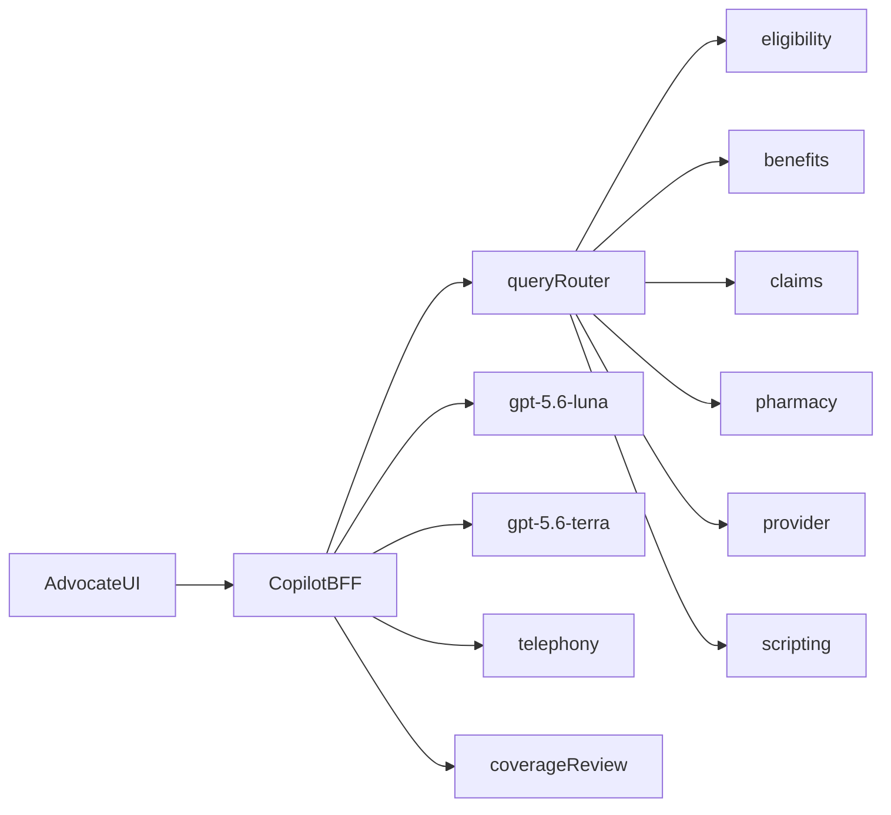

# PLAN.md — Humana Agent Assist (approved 17 Sep 2026)

**This is the only plan we implement.** Cursor’s `.cursor/plans/step_0_prototype_plan_*.plan.md` is a leftover UI draft from Step 0 and is not a source of truth. If the two ever disagree, this file wins.

Approved Step 0 plan with Harish’s nine changes. Product behavior remains [`docs/FINAL_PRODUCT_DECISIONS.md`](docs/FINAL_PRODUCT_DECISIONS.md) §§10–22 / §15. Do not reopen it. Do not undo the REST override without asking Harish.

## Recorded override (item 1)

**Contract line overridden (Harish direction):** header *“Source labels do not require six integrations”* and §15 *“Use one synthetic store if convenient.”*

**Replacement:** Per-system **simulated REST is the only retrieval boundary**. App/BFF code must not import fixture JSON for answers. Fixture files load **only** inside `/api/simulated/*` route handlers. Enrollment `POST` returns **403** without a human actor. Replays may inject delay / 404 / overlay via handler headers or overlay files. Later sessions must not collapse this back to in-process fixture reads. Also recorded in [`DECISIONS_LOG.md`](DECISIONS_LOG.md).

These are not real Humana hosts. Paths are `/api/simulated/{benefits|eligibility|claims|pharmacy|provider|scripting}/...` plus **telephony** and **coverage-review beside** the six. Every response: `{ "simulated": true, "sourceSystem": "<one of six | telephony | coverage-review>", "asOf": "<ISO-8601>", "data": { } }`. Payloads are **illustrative shapes — real integration maps to Humana's APIs.** Do not describe them as NCPDP-, CMS-, or FHIR-compliant.

## Stack

**Next.js (App Router) + TypeScript + React**, one process. OpenAI via `OPENAI_API_KEY`. In-memory session + JSONL run log. Vitest for disclosure/router unit checks and replay driver later. **No Playwright now** (C06 is a manual UI checklist unless time remains after M3). **No mock REST contract-test suite.**

Standalone page standing in for an embedded call desktop (§14). Say so in README and when presenting.

### Models (re-verified 17 Sep 2026 against [OpenAI Models](https://developers.openai.com/api/docs/models))

Current flagship family on that page is **GPT-5.6** (Luna / Terra / Sol / Astra). Do not use `gpt-4o`, `gpt-4o-mini`, or `gpt-5.4-mini` as the recorded IDs.

| Tier | Model ID | Use |
|---|---|---|
| **Fast** | `gpt-5.6-luna` | Per-utterance interpretation (call type / needs / focus / consent) and disclosure **trigger recognition** on partial transcripts. Catalog: cost-sensitive high-volume; supports `reasoning.effort: none` (required for the 1s path). |
| **Mid** | `gpt-5.6-terra` | Multi-source historical explanation, wrap, handoff draft. Catalog: balances intelligence and cost. Call with `reasoning.effort: none` unless C05 quality fails; do not silently switch IDs. |
| **Embeddings** | `text-embedding-3-small` | Document embeddings computed **once at process startup**. Per request, embed the **query only**. No vector database. |

## Real vs simulated

| Layer | Real | Simulated (labeled) |
|---|---|---|
| Transcript | Consume partial/final/corrected/uncertain | Telephony, ASR, IVR hint |
| Interpretation | Fast-tier model from utterances | — |
| Disclosure exactness/timing/nudge | Plain code + registry text | — |
| Disclosure **triggers** | Two-stage: registry-pattern **code** (instant) then luna on ambiguous partials | — |
| Retrieval | HTTP only + query-router (below) | Six simulated REST systems + telephony + coverage-review |
| Answers / wrap / handoff | Mid-tier model from session evidence | Amounts/IDs/status from REST |
| Enrollment / coverage decision / payment / clinical | **No AI path** | Human `POST` enroll; coverage **read** only |

Test driver may supply transcript, system results, human actions. It may never inject AI classifications, answers, or badges (§19.1).

**Evaluator answers:** live only under `tests/`. Prevention: ESLint `no-restricted-imports` (and TypeScript path) blocking `tests/**` from `app/**` and `src/**` / `lib/**`. CI/lint fails if app code imports golden files. Document this in README.

## Six systems — endpoints in use only

Humana names: **benefits, eligibility, claims, pharmacy, provider, scripting**.

**Coverage case:** not one of Humana’s six tab-hunt systems. Serve **beside** the six, like telephony: `GET /api/simulated/coverage-review/cases/{caseId}`. Label `sourceSystem: "coverage-review"`. Status **read** only; no determination write.

**Telephony:** not a member-data system. Serve **beside** the six: `GET /api/simulated/telephony/ivr/current-hint`, `POST /api/simulated/telephony/transfers`. Label `sourceSystem: "telephony"`. Shown on the architecture diagram.

**Dropped:** practitioner endpoint; extra directory search; payment; coverage determination write; mock contract tests; any endpoint the main call and six replays do not use.

| System | Endpoints (all `/api/simulated/...`) | Why (main + T02A/T03A/T03B/T04B/T06A/T08B) |
|---|---|---|
| eligibility | `POST /eligibility/authorizations`; `GET /eligibility/members/{memberId}` | `DEMO-AUTH001`; member 403 until VALID |
| benefits | `GET /benefits/plans/{planId}`; `GET /benefits/plans/{planId}/pharmacy-network?asOfDate=`; `GET /benefits/plans/{planId}/cost-share` | Plan; `DEMO-NET0818/0916`; `DEMO-POLICY-COST-v1`; T06A overlay omits NET0818 |
| claims | `GET /claims/pharmacy?memberId=&dateOfServiceFrom=&dateOfServiceTo=` | `DEMO-C0818/C0916` only — no coverage case here |
| pharmacy | `GET /pharmacy/prescriptions?memberId=`; `GET /pharmacy/refill-requests/{id}`; `GET /pharmacy/refill-requests/{id}/status`; `GET /pharmacy/quotes`; `POST /pharmacy/enrollments`; `GET /pharmacy/enrollments/{id}` | Rx, RF001 exist vs fresh ready; six quotes (`validityStatus: "valid"` in the main run); T04B overlay; human enroll `DEMO-ENR001`; T08B no submit |
| provider | `GET /provider/pharmacies/{pharmacyId}` | Lakeview, Oak Street, CenterWell **names/ids from §15 only** — no NPI |
| scripting | `GET /scripting/disclosures`; `GET /scripting/disclosures/{requirementId}`; `GET /scripting/articles/{articleId}`; `POST /scripting/knowledge/search` | Verbatim; `DEMO-SERVICE-v1` / `DEMO-FAST90-v1` / objection; SEARCH returns **raw** candidates including `DEMO-POLICY-OTHER-v1` (copilot filters; mock does not) |
| telephony (beside) | `GET /telephony/ivr/current-hint`; `POST /telephony/transfers` | IVR refill hint; `DEMO-TRANSFER001` |
| coverage-review (beside) | `GET /coverage-review/cases/{caseId}` | `DEMO-CVR001` pending; not a claims resource |

`POST /pharmacy/enrollments`: one-time **server-minted enrollment token** from presenter Confirm (`POST /api/session/human/mint-enrollment-token`), bound to read-back `medicationScope`. Mock **403** if token missing, already used, or scope differs. **AI tool registry has no mint/read/submit.** Not an `actorType` header.

Delay / 404 / overlay: `X-Demo-Delay-Ms`, `X-Demo-Overlay`, `X-Demo-Force-Status`.

## No facts beyond §15 (item 3)

Standard-style **field names** are fine. **Values** only from §15. Do **not** invent or include: ordering clinician, `refillsRemaining`, `rxNumber`, `subscriberId`, `contractId`, NPI, NDC, rxcui, addresses, ANI, or any other non-§15 fact.

Illustrative names we **may** use when the value is in §15: `memberId`, `planId`, `lineOfBusiness`, `authorizationId`, `decision`, `role`, `claimId`, `adjudicationStatus`, `dateOfService`, `drugName`, `strength`, `dosageForm`, `quantity`, `daysSupply`, `pharmacy.name` / `pharmacyId`, `memberPaidAmount` `{ value, currency }`, `appliedCostShareCategory`, `fillStatus`, `quoteId`, `estimatedMemberCost`, `asOf`, `validityStatus` (`valid` in the main run — §15 validity status, **not** an invented `validUntil` timestamp), `enrollmentId`, `medicationScope`, `verbatimText`, `requirementId`, `version`, `caseId`, `status`, `requestedMedication`, `determination` (null while pending), `ivrReason`, `connectionStatus`.

Money ISO 4217; dates ISO-8601; DEMO-* IDs unchanged.

## Visible architecture (item 4)

Every evidence label in the UI: **`System record · {system} · simulated`** or **`Governed guidance · scripting · simulated`** or **`Derived from source/version · scripting · simulated`**.

README contains the system diagram (same as below).

## Query router (item 6)

One function `routeQuery(request) → { routesUsed[], results, latencyMs }` — no router framework.

**Compose, do not stop at the first hit.** A multi-source question runs every applicable route and merges evidence. Fall through only for *unused* routes (nothing to contribute), not as “first success wins.”

Order of evaluation (each step may add evidence):

1. **Disclosure registry** — exact wording / applicability records (scripting GET by id or list).
2. **Structured lookup** — eligibility, claims purchases, pharmacy status/quotes, provider pharmacy, coverage-review case GET, enrollment GET, dated pharmacy classifications / cost-share rows.
3. **Governed derived answer** — `DEMO-FAST90-v1` when the need matches and lineage source is valid.
4. **Ranked knowledge search** — `POST /scripting/knowledge/search` returns **raw candidates** (including distractor `DEMO-POLICY-OTHER-v1`). **Copilot code** (not the mock server) filters by plan / effective date / audience, then ranks remaining by in-memory embedding similarity. Rejection is logged (`rejected: wrong plan`) and shown in diagnostics.
5. **Partial / withhold / clarify** — §12.2, when still-needed conclusions lack support.

**Main-call historical $8/$27 question (must visibly exercise route 4):** structured lookup supplies purchases (`DEMO-C0818` / `DEMO-C0916`) and dated pharmacy classifications (`DEMO-NET0818` / `DEMO-NET0916`); the governing policy passage comes from SEARCH; `DEMO-POLICY-OTHER-v1` is a raw candidate and is **rejected by the copilot applicability filter**. Diagnostics must show that rejection. Fetch-by-ID alone does **not** satisfy §17 Real AI floor.

Log every route used (not only the first), per-route latency, retrieved IDs, rejected IDs + reason.

## Disclosure (item 7)

| Concern | Implementation |
|---|---|
| Exactness, stitching rules, timing vs delivery, obligation state, **fixed nudge templates** | Plain code + registry `verbatimText` (byte-for-byte) |
| Trigger recognition | **Two-stage** (pricing and “service choice actually discussed”). Keep `gpt-5.6-luna`. **Do not relax the 1s target.** |

**Stage 1 (code, instant — no model).** Fire the pricing trigger only when **all** hold:

1. Advocate utterance contains an amount (digits or spelled-out).
2. It contains a future-estimate cue from the **registry** trigger patterns (not code constants).
3. Current need is prospective comparison.

Stage 1 **must never** fire on historical-charge speech. A fired compliance nudge **must never need retracting**.

Same two-stage idea for closing/service-choice: stage 1 only when registry cues plus actual discussion evidence are complete; otherwise stage 2.

**Stage 2 (`gpt-5.6-luna`, `reasoning.effort: none`).** Anything ambiguous — amount without a cue, amount during the historical-price need, comparative language without a figure, incomplete service-choice discussion. Run on **partials**. Log classification and measured latency. Record 1s **misses honestly**.

**Clock (§22.1):** starts at the first transcript event containing a **complete amount plus estimate context**. Classification may start earlier on partials; the clock definition does not move.

**Warm-up:** keep-alive HTTP client. One warm-up luna request at **call connect** so the first real classification is never the cold call. Document embeddings: once at startup; query embedding per SEARCH request.

**C01 (M3, not M1):**

- Stage-1 hit: “Lakeview estimate is fifteen dollars” during prospective comparison — fires **without** a model call.
- Stage-2 case: estimate language spoken during the **historical** discussion — luna; must not produce a retractable pricing nudge.
- Historical “$8 / $27” speech **must not** trigger pricing (stage 1 silent; stage 2 if invoked must classify historical / none).

Quiet greeting: code exactness on adequate advocate transcript vs `DEMO-GREETING-v1`. No acknowledgement click.

## Demo mechanics (item 9)

- Advocate lines stay in the **timed stream**. Presenter-gated **pauses** at advocate reaction points. Mark pause intervals; **never** count them as machine response time.
- Stretch / QA view **off**.
- `SUBMISSION.md` **deferred until after M3**. Ambiguity 9 stands until then.
- C06: **manual UI checklist**; no Playwright setup now.

## Fixtures (handler-only)

Built from §15: disclosures, member, auth, prescriptions, refill, purchases, classifications, policies (incl. OTHER), quotes, service/FAST90/objection, roles, coverage, actions, `streams/t01_main.json` (M1 subset first). Replay streams in M3. Evaluator conclusions **not** in fixtures.

## Stream, state, log

Timed player: partial/final/corrected/uncertain. Pause/resume marked.

State §13: call type, needs, focus, guidance validity, obligations, action pipeline — from evidence, **never beat numbers**. T06A remains the changed-input proof.

Log §22.3 JSONL + diagnostics: events, identity, source/rule versions, selected/rejected evidence, route, trigger classifications, human actions, timing (event-to-useful-display), usage, injected faults. No chain-of-thought or secrets.

## UI

Five regions §14: call strip (no member fields before `DEMO-AUTH001`), obligation rail, Now card, context drawer, compact transcript (partial/final/corrected/uncertain not by color alone). Evidence labels include source system (item 4).

## Build order

- **M1** — Walking skeleton: timed stream (partial/final/corrected), five-region screen, quiet greeting verify, no member data before simulated auth (`POST` eligibility). Live REST: eligibility, telephony IVR **and** `GET /scripting/disclosures`. Luna keep-alive **warm-up at call connect**. Pause gates. Show the app.
- **Then** remaining simulated REST, router, SEARCH, trigger classifier — needed before/during M2, not a separate product.
- **M2** — Full §10/§20 main call with Harish as advocate. **No M3 until M2 runs end to end.**
- **M3** — Two fresh mains, six replays, C01–C03 and C05–C06 (C06 manual). Keep every run record.

Time-cap cut order §10. Never cut beats 4–5, 9, 10, 12, 13–15.

## Deliverables

Running app; `/fixtures`; tests for M3; `runs/`; `DECISIONS_LOG.md`; README (real vs simulated, how to run, limitations, architecture diagram, import exclusion). `SUBMISSION.md` after M3 only.

## Flagged ambiguities (unchanged handling)

1. Brief “prevention” vs contract catch-and-correct — build catch-and-correct; do not claim the pricing nudge prevented the miss.
2. Brief “beat” vs no beat-keying — key off evidence, never `beat === n`.
3. Attestation in registry vs Tier 3 — reread only; no attestation control; honest limitation if hit.
4. Beat 16 QA vs stretch — not built.
5. Advocate speech — **resolved:** timed stream + presenter-gated pauses.
6. Absolute yes — model + fixed clarification template; hedge is not consent.
7. Wrong-scope enrollment — C02 injection; main path metformin-only; no false success.
8. Do-not-call — detect unsupported; no fake DNC workflow.
9. Five artifacts vs kickoff list — `SUBMISSION.md` **after M3**.
10. Six REST vs contract “no six integrations” — **overridden; recorded above.** Practitioner endpoint **dropped**. Coverage-review and telephony sit **beside** the six.

§15 remains authoritative for every fact, amount, ID, and disclosure string.
