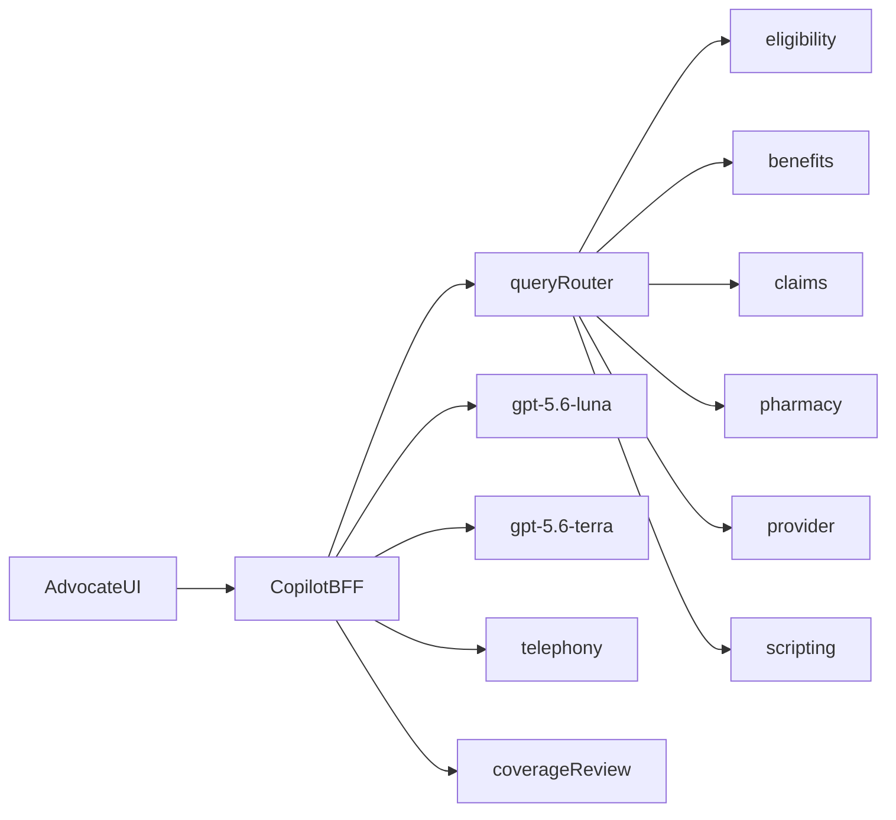

# Humana Agent Assist (prototype)

Standalone web page standing in for an **embedded** advocate call desktop ([contract §14](docs/FINAL_PRODUCT_DECISIONS.md)). Not a chat panel.

**Milestone:** M3 complete. Five Humana artifacts are in [`SUBMISSION.md`](SUBMISSION.md).

## How to run

```bash
# .env already holds OPENAI_API_KEY (do not commit it)
npm install
npm run dev
```

Open http://localhost:3000.

- **Start main call** — timed stream through beats 0–15. Resume at presenter pauses. Human controls: Offer, Use governed response, Confirm/Submit enrollment, Confirm Coverage Review destination, Execute transfer, Confirm disposition.
- **Replay T02A–T08B** — six §19.3 streams (T06A omits DEMO-NET0818).

```bash
npm test                 # C01–C03/C05 unit + live replays if the app is up
RUN_T01=1 npm run test:t01
```

The live page receives session updates over **server-sent events** (`GET /api/session/events`). Compliance nudges are published as soon as stage-1 / wording verification runs; they do not wait on conversation interpretation.

## What is real vs simulated

| Real | Simulated (labeled in the UI) |
|---|---|
| Conversation interpretation, disclosure **trigger** classification, query routing, ranked knowledge search, answer/wrap generation | Telephony / ASR / IVR, identity-and-role, benefits, claims, pharmacy, provider directory, scripting store, coverage-review **read**, transfer connection |

Mandatory disclosure **text** is copied byte-for-byte from the scripting registry. Exactness, timing, and nudge copy are code. **Two-stage pricing trigger:** stage 1 is registry-pattern code (never historical charges; never retract a fired nudge); stage 2 is `gpt-5.6-luna` on ambiguous partials. Luna keep-alive warm sample (17 Sep 2026): warmup 1563 ms discarded; 10 sequential 1330, 893, 1132, 757, 906, 1431, 838, 809, 1401, 843 ms; **median 899 ms, max 1431 ms, 4/10 missed 1s** (recorded honestly). Enrollment: human Confirm mints a one-time server token bound to read-back scope; `POST /api/simulated/pharmacy/enrollments` is **403** without an unused matching token. AI tools cannot mint or submit.

## Architecture (six Humana systems + telephony and coverage-review beside)



Evidence labels look like `System record · pharmacy · simulated`.

**Recorded override:** simulated REST is the only retrieval boundary (Harish, 17 Sep 2026). This overrides the contract line “source labels do not require six integrations.” See [`PLAN.md`](PLAN.md) and [`DECISIONS_LOG.md`](DECISIONS_LOG.md).

Payloads are **illustrative shapes — real integration maps to Humana's APIs.** Values come only from contract §15.

## Evaluator isolation

`tests/` must not be imported by `app/` or `lib/`. Guard: ESLint `no-restricted-imports` (lint failure), plus Next resolve alias. Not a comment-only rule.

## Known limitations

- Stretch / post-call QA view is off.
- C06 is a manual UI checklist (`tests/c06_checklist.md`).
- One of two T01 mains was automated (`RUN_T01=1`); C06 walked the presenter path in the UI. Stretch QA is off.
- `SUBMISSION.md` holds the five Humana artifacts (problem, service design, prototype, roadmap, tradeoff).
- Tier 3 (quick ask, attestation, retry, outage) is not built; those conditions show an honest limitation.
